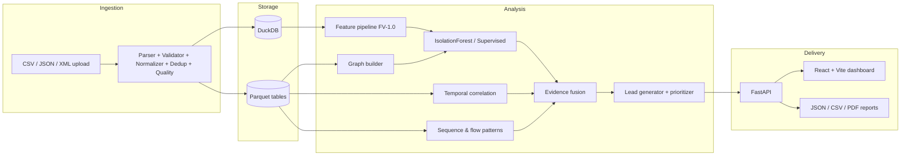

# ChainGuard AI

**From Bitcoin Signals to Traceable Evidence**

An **offline**, AI-powered Bitcoin forensic investigation platform that correlates wallet, transaction, temporal, network, and graph evidence to produce **explainable investigative leads**.

> **DISCLAIMER (SYNTHETIC / DEMO DATA):** ChainGuard AI operates only on user-supplied or locally generated *synthetic* observations. It performs **no live interception, no live blockchain monitoring, no deanonymization, and no identity attribution**. All analytical signals are investigative leads that require **human review**. Analytical signals and observed relationships do not independently establish criminal activity or real-world identity.

---

## Problem

Bitcoin's pseudonymous, peer-to-peer design lets criminal actors move, layer, and cash out illicit funds — ransomware payments, darknet-market proceeds, extortion, and laundering — while evading traditional financial surveillance. Investigators need to correlate **network-layer** observations (IP/port/timing) with **blockchain-layer** data (wallet/TXID/amount) and turn that into prioritized, explainable leads.

## Why existing approaches are insufficient

- Generic transaction dashboards show activity but do **not correlate network-layer and blockchain-layer evidence**, and rarely explain *why* something was flagged.
- Hard-coded rule engines are brittle and cannot express multi-signal anomaly strength.
- Cloud analytics SaaS cannot be used when evidence handling requires a **fully offline** workflow.
- Most tools emit a score without provenance: no model version, feature version, dataset hash, or reproducible run metadata.

## The ChainGuard AI solution

An offline cross-layer evidence workflow:

```
IMPORT → VALIDATE → ANALYZE → DETECT → CORRELATE → FUSE EVIDENCE → GENERATE LEADS → TRACE → REVIEW → REPORT
```

## Key innovation

The **cross-layer correlation engine**: every lead carries a full, clickable evidence chain —

```
Network Observation (IP/port) → Temporal Association → Transaction (fee, script_type)
→ Wallet → Behavior → Sequence/Flow Pattern → Graph Relationship → ML Signal → Evidence Fusion → Investigative Lead
```

Each association preserves relationship type, timestamp, time difference, confidence, supporting fields, and a stable evidence ID.

## Architecture



## Features

- Multi-format ingestion (CSV, JSON, XML) with **all required fields** incl. `fee` and `script_type`
- Data-quality transparency: invalid records are reported, never silently dropped
- Cross-layer correlation with configurable temporal windows (default 30 s, exponential decay confidence)
- Real ML anomaly detection (IsolationForest baseline; supervised classifier when labels exist)
- Separate **Anomaly Score** and **Evidence Strength** (0–100)
- Explainable AI: per-feature observed vs baseline vs contribution (SHAP-compatible)
- **"What would change this?"** counterfactual-style explanations
- Behavioral wallet clustering (DBSCAN), flow-pattern detection (fan-in/fan-out/multi-hop/rapid-forwarding/splitting/consolidation/peeling)
- **Trace Evidence** interactive evidence-chain exploration with graph neighborhood expansion
- Investigator / Analyst / Technical modes
- Analyst feedback (Relevant / False Positive / Needs Review + note)
- Reproducible runs (run ID, dataset SHA-256, model + feature versions, configuration)
- JSON / CSV / PDF forensic-style reports
- 100% offline operation; optional local GeoIP (GeoLite2 mmdb) enrichment

## Installation (Linux / macOS / Windows)

```bash
# Backend
python -m venv .venv
source .venv/bin/activate            # Windows Git Bash: source .venv/Scripts/activate
pip install -r requirements.txt

# Frontend
npm install
npm --prefix frontend install
```

Or with Docker:

```bash
docker compose up --build
```

## Offline operation

After installation the app runs with **no internet**: no external AI APIs, no online blockchain explorers, no CDN assets, no telemetry. Optional GeoIP uses a local file at `data/geoip/GeoLite2-Country.mmdb`; if missing, the UI shows *GeoIP enrichment unavailable* and analysis continues.

When running, the UI displays:

```
OFFLINE MODE
All analysis is running locally. No dataset is transmitted to an external service.
```

## Dataset format

CSV / JSON / XML records with fields:

| Field | Type | Example |
|---|---|---|
| `timestamp` | ISO-8601 | `2026-01-01T10:00:00Z` |
| `src_ip`, `dst_ip` | IPv4/IPv6 | `192.0.2.10` |
| `src_port`, `dst_port` | 0–65535 | `8333` |
| `txid` | string | `tx-demo-001` |
| `input_addresses[]` | array | `["wallet-a"]` or `wallet-a\|wallet-b` |
| `output_addresses[]` | array | `["wallet-b"]` |
| `input_amounts[]` | array | `[1.25]` or `1.25\|0.8` |
| `output_amounts[]` | array | `[1.2]` |
| `fee` | float | `0.05` |
| `script_type` | enum | `P2PKH`, `P2SH`, `P2WPKH`, `P2WSH`, `P2TR`, `NONSTANDARD` |
| `geo_country` | ISO country | `IN` |
| `asn` | string | `AS64500` |

Generate the deterministic demo dataset:

```bash
python scripts/generate_demo_data.py
```

## ML methodology

- **Unsupervised default:** `IsolationForest(n_estimators=200, contamination="auto", random_state=42)` over versioned features (FV-1.0).
- **Supervised path:** if the dataset contains labels (e.g., injected-pattern flags), a gradient-boosting / random-forest classifier is trained via the same `BaseDetector` interface.
- **Explainability:** per-feature contribution table (observed vs baseline vs contribution) computed from the model's feature importances / SHAP when available.
- Scoring produces two independent 0–100 numbers: **Anomaly Score** (how unusual) and **Evidence Strength** (how much independent, consistent supporting evidence exists). Neither is a probability of guilt.

See `docs/ml-methodology.md` and `docs/model-card.md`.

## Explainability

Every alert answers "Why was this flagged?" with a per-feature table (observed, baseline, contribution, source records), plus a counterfactual section — *What would change this?* — derived only from the implemented scoring logic.

## Evidence tracing

The **TRACE EVIDENCE** action expands the full evidence chain for a lead: transaction → wallet → counterparties → network observation → temporal relationship → flow pattern → ML signal → fused evidence → lead. Every node is clickable; every edge shows relationship type, timestamp, confidence, and source record.

## Security

- File-size / extension / MIME validation, safe temp storage, path-traversal protection
- Parameterized DuckDB queries, safe XML parsing (no entity expansion), no execution of uploaded files
- No hidden telemetry; nothing leaves the machine

## Synthetic demo

```bash
make demo          # one command: data → pipeline → backend → frontend → URLs + run ID + lead count
```

## Testing

```bash
make test          # backend unit + integration tests (pytest), frontend tests (vitest)
npm --prefix frontend run build   # frontend typecheck + build
```

## Performance

DuckDB + Parquet batch analytics; graph built once per run with bounded neighborhoods served on demand; ML inference vectorized with scikit-learn. Demo-scale data runs end-to-end in seconds.

## Limitations

- Synthetic demo data is not real blockchain data; evaluation numbers are **synthetic evaluation** only.
- NetworkX graph limits practical scale (see `docs/scalability.md` for the migration path).
- GeoIP is optional and requires a local GeoLite2 mmdb (not bundled for licensing reasons).

## Future work

Graph-database backend, streaming ingestion, HDBSCAN clustering, active-learning feedback loop with tested retraining, multi-dataset federation.

## SIH demo flow (3–5 minutes)

1. Open **Overview** — show transactions, wallets, network observations, clusters, leads.
2. **Data Intake** — upload a synthetic CSV/JSON/XML dataset; show validation statistics.
3. Run analysis — show the pipeline progress stages.
4. Show **ranked investigative leads** in Alerts.
5. Open a high-priority lead — show **Anomaly Score** and **Evidence Strength**.
6. Click **TRACE EVIDENCE** — walk the evidence chain.
7. Open **WHY FLAGGED?** — show the explanation table.
8. Show **Graph Analysis** and **Timeline**.
9. Switch to **Technical Mode** — model, versions, dataset hash, run ID, inference time.
10. Export the **report**.

## Screenshots

*(placeholder — add dashboard, alerts, investigation workspace, trace-evidence screenshots here)*

## API documentation

When the backend runs: **http://localhost:8000/docs** (OpenAPI UI).

## License

MIT — see `LICENSE`.
