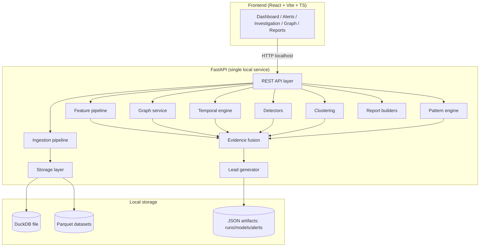
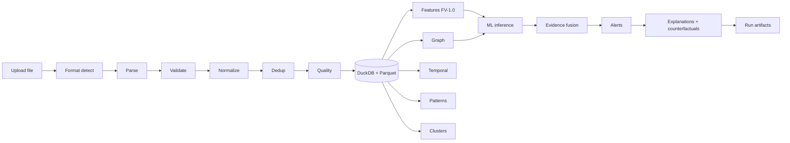

# ChainGuard AI — Architecture

## 1. System Architecture



The backend is a single FastAPI process. Heavy operations (ingestion, analysis runs) execute synchronously on demo-scale data but are structured as a staged pipeline that emits progress events; endpoints stay simple and stateless per request.

## 2. Data Flow



1. **Ingestion** produces normalized tables (transactions, wallets, network observations, records) and a quality report.
2. **Analysis run** reads normalized data, extracts features, builds the graph, correlates temporally, detects flow patterns, runs ML, clusters wallets, fuses evidence, generates alerts, and persists run artifacts.
3. **Serving** reads only indexed/tabular slices — never the full dataset into the browser.

## 3. Module Boundaries

| Module | Path | Responsibility | Must not |
|---|---|---|---|
| ingestion | `backend/app/ingestion/` | parse/validate/normalize/dedup/quality | touch storage schema |
| storage | `backend/app/storage/` | DuckDB + Parquet IO, repositories | interpret analytics |
| features | `backend/app/features/` | versioned feature frames | infer anomalies |
| graph | `backend/app/graph/` | build/query NetworkX graph | store alerts |
| temporal | `backend/app/temporal/` | windowing, decay confidence, sequences | score entities |
| detection | `backend/app/detection/` | detectors, model registry, scoring | read files |
| clustering | `backend/app/clustering/` | DBSCAN/HDBSCAN + profiles | generate alerts |
| patterns | `backend/app/patterns/` | fan-in/out, multi-hop, rapid, split, consolidation, peeling | call ML |
| evidence | `backend/app/evidence/` | fusion, explanations, counterfactuals, trace | write reports |
| alerts | `backend/app/alerts/` | lead generation, prioritization, persistence | run models |
| reports | `backend/app/reports/` | JSON/CSV/PDF builders | compute scores |
| api | `backend/app/api/` | HTTP surface only | contain business logic |

Cross-module communication goes through plain dataclasses/Pydantic models and repository interfaces — no hidden global state; the `AppState` container is injected via FastAPI dependencies.

## 4. API Design

Full surface (Pydantic schemas, pagination via `page`/`page_size`, filters, `sort`):

```
GET  /api/health
POST /api/datasets/upload        multipart upload → IngestionResult
GET  /api/datasets
GET  /api/datasets/{dataset_id}
GET  /api/datasets/{dataset_id}/quality
GET  /api/datasets/{dataset_id}/errors
POST /api/analysis/run           RunRequest → RunResult (staged progress summary)
GET  /api/runs, /api/runs/{run_id}
GET  /api/alerts                 filters: priority, status, entity_type, q, sort
GET  /api/alerts/{alert_id}
GET  /api/alerts/{alert_id}/evidence
GET  /api/alerts/{alert_id}/timeline
GET  /api/alerts/{alert_id}/graph
GET  /api/alerts/{alert_id}/explanation
GET  /api/wallets, /api/wallets/{wallet_id}
GET  /api/transactions, /api/transactions/{txid}
GET  /api/network/observations
GET  /api/clusters
GET  /api/metrics
GET  /api/graph/neighborhood     entity_id, max_hops, edge_types, confidence_min
POST /api/feedback
POST /api/reports                {alert_id | run_id, format: json|csv|pdf}
```

Errors: structured `{ "detail": ... }` JSON via exception handlers; no stack traces to clients.

## 5. Storage Model

- **DuckDB** single file (`backend/storage/chainguard.duckdb`): tables `transactions`, `wallets`, `network_observations`, `ingest_records`, `alerts`. All queries parameterized; pagination via `LIMIT/OFFSET` with `ORDER BY`.
- **Parquet** per dataset (`backend/storage/parquet/<dataset_id>/*.parquet`): normalized records + cached feature tables + graph edges → reproducible artifacts.
- **JSON artifacts** (`backend/storage/artifacts/`): run metadata, model registry entries, alerts, explanations, feedback.

Dataset id format `DS-0001`; run id `RUN-<year>-<seq>`; alert id `CG-AL-<seq>`; evidence id `EV-<seq>`.

## 6. ML Pipeline

```mermaid
flowchart LR
    FT[Feature frames FV-1.0] --> VS[Feature vectorization]
    VS --> IF[IsolationForest] 
    VS --> SU[SupervisedDetector if labels]
    IF & SU --> SC[Scoring: anomaly 0-100]
    SC --> EF[Evidence fusion]
    EX[Contribution explainer (importance/SHAP)] --> EF
```

- Model registry stores `{model_name, model_version, training_dataset_id, feature_version, training_timestamp, training_metrics, artifact_path}`.
- `BaseDetector.fit(rows, labels|None)` / `.score(rows)` / `.explain(row)`; provenance attached to every output.
- Anomaly score maps decision function to 0–100 via observed min/max normalization within the run; rule-based detectors (patterns/temporal) add weighted signals — weights live in config, not code constants.

## 7. Graph Model

Nodes: `wallet:<address>`, `tx:<txid>`, `ip:<ip>`, `obs:<observation_id>`.
Edges: `INPUT_TO`, `OUTPUT_TO`, `OBSERVED_ON`, `CONNECTED_TO`, `SAME_COUNTERPARTY`, `TEMPORALLY_ASSOCIATED` (each carries confidence + evidence id).
Metrics per node: degree, in/out degree, betweenness (bounded sample on large graphs), clustering coefficient, component size, neighbor count. The API never returns the whole graph — neighborhoods with `max_hops` (default 2, cap 4) and edge-type/confidence filters.

## 8. Evidence Model

`Evidence` = {evidence_id, category ∈ {TRANSACTION, WALLET, TEMPORAL, GRAPH, NETWORK, SEQUENCE, ML}, summary, confidence, record_ids, fields, relationship}. Fusion counts **independent categories**, weights confidences, and computes Evidence Strength 0–100. Every alert references concrete evidence IDs; nothing is synthesized for presentation.

## 9. Security Boundaries

- Uploads: size cap (250 MB default), extension allowlist (.csv/.json/.xml), MIME sniff, stored outside web root under `data/uploads/` with generated names (no user-controlled paths).
- XML parsing with `defusedxml`-equivalent settings (no DTD/entity resolution) — implemented via `xml.etree.ElementTree` with a parser that forbids entities + `expat` hardened defaults; JSON size-checked before parse.
- DuckDB access strictly parameterized; no string interpolation of user input.
- No subprocess execution, no dynamic deserialization of user files, no eval.
- CORS restricted to localhost origins; no telemetry.

## 10. Scalability Plan

- Batch/vectorized DuckDB SQL for aggregations; Parquet columnar reads; features computed in Polars/Arrow-friendly batches.
- Graph: NetworkX prototype → swap to graph DB or cuGraph via the same `GraphRepository` interface; betweenness approximated with k-sample pivots above 20k nodes.
- ML: sklearn vectorized inference; streaming ingestion is future scope; API paginates everything.

## 11. Deployment Architecture

Native: `make demo` → venv backend (uvicorn :8000) + Vite dev server (:5173) or production build served by the backend. Docker: single multi-stage image (frontend build → FastAPI static mount), `docker compose up --build`. Both offline after image/dependency install.
